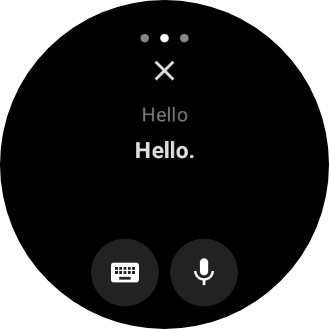
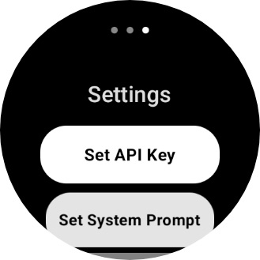

# Gemini Client for Wear OS


An unofficial, open-source client for the Google Gemini API, designed and built for Wear OS devices. This application allows you to interact with Google's powerful AI models directly from your smartwatch.

## Screenshots

| Chat Screen | History | Settings |
| :---: | :---: | :---: |
|  |  |  |

## Features

* **Direct Gemini API Interaction**: Send prompts and receive responses from the Gemini 2.5 Flash.
* **Conversation History**: Your chats are saved on-device for later viewing.
* **Native Wear OS Interface**: A clean and user-friendly interface built with Compose for Wear OS.
* **Rotary Input**: Smoothly scroll through conversations using your watch's rotating side-button or bezel.
* **Secure API Key Storage**: Your Google AI API key is stored securely on your device.

## Setup

To use the application, you need a Google Gemini API key.

1.  **Get an API Key**:
    * Go to [Google AI Studio](https://aistudio.google.com/).
    * Sign in with your Google account.
    * Click on **"Get API key"** and then **"Create API key in new project"**.
    * Copy the generated API key.

2.  **Install the App**:
    * Go to the [Releases page](https://github.com/iamalbedo1/chatclientforgemini/releases) of this repository.
    * Download the latest `app-release.apk` file.
    * Sideload the APK to your Wear OS watch using `adb` or a third-party sideloading tool.

3.  **Configure the App**:
    * Open the app on your watch.
    * Navigate to the **Settings** screen.
    * Paste your Gemini API key into the text field and save it.

## Building from Source

If you wish to build the project yourself, follow these steps:

1.  Clone the repository:
    ```bash
    git clone [https://github.com/iamalbedo1/chatclientforgemini.git](https://github.com/iamalbedo1/chatclientforgemini.git)
    ```
2.  Open the project in the latest stable version of Android Studio.
3.  Let Gradle sync and download the required dependencies.
4.  Build the project (`Build` > `Make Project`).
5.  You can run the app on an emulator or a physical Wear OS device.

## Contributing

Contributions are welcome! If you have an idea for a new feature, find a bug, or want to improve the code, please feel free to open an issue or submit a pull request.

